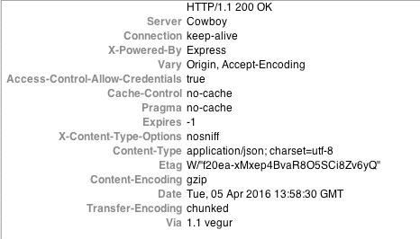
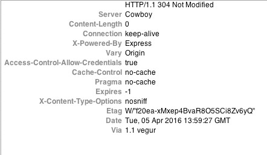

# PhotoProject

Android application fetching and displaying pictures.

##Technical Choice & Quality
- Retrofit w/ okhttp have been used for the request layer
- Glide (over Picasso) is used for image fetching
- RxJava is used for asynchronous computation
- Unit Tests have been written on relevant places

##TODO
- Display 'waiting placeholder' on Main Screen while fetching list
- cache response (it's 304 though)
- 'show albums' screen
- 'show photos per album' screen
- show big image on photo click
- use ButterKnife for view binding

##304 and Etag
The application http client has been configured with a cache.
As we can see on the response header of the request, the server emits a 304 response, that allows us
to use response in cache

<table>
<tr>
<th>First request </th>
<th>Subsequent requests </th>
</tr>
</table>

##Issue
- thumbnails are 301 redirected. Issue fetching images with Picasso. Using Glide instead.
